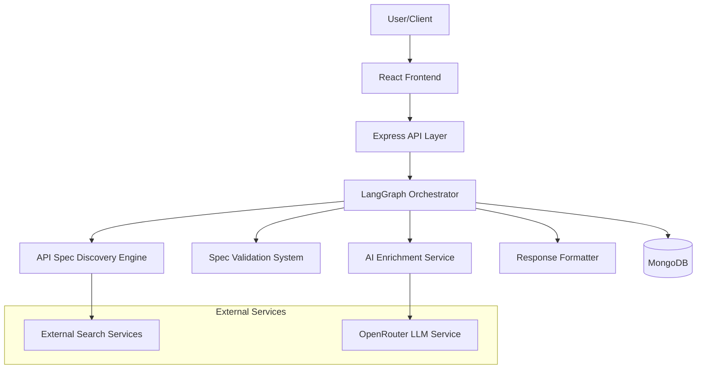
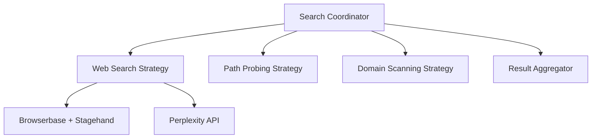
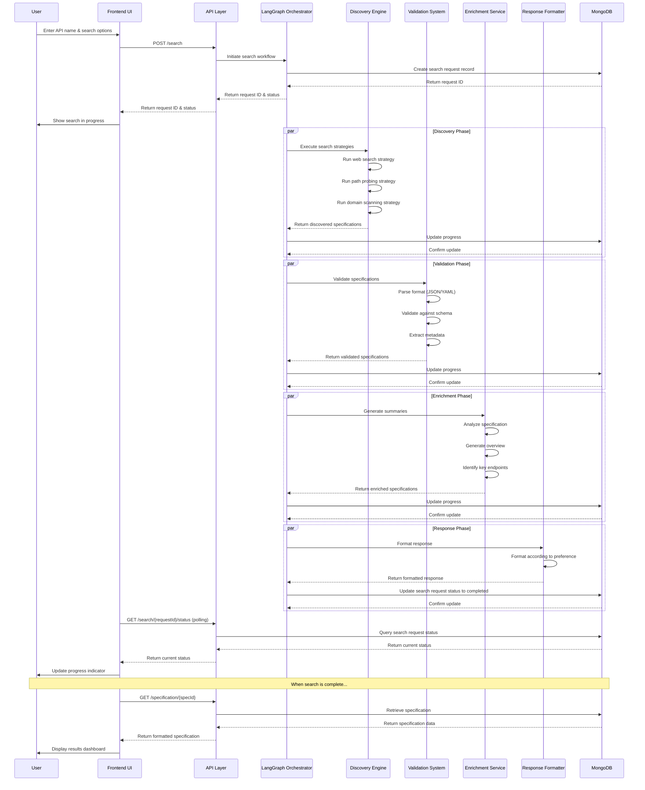
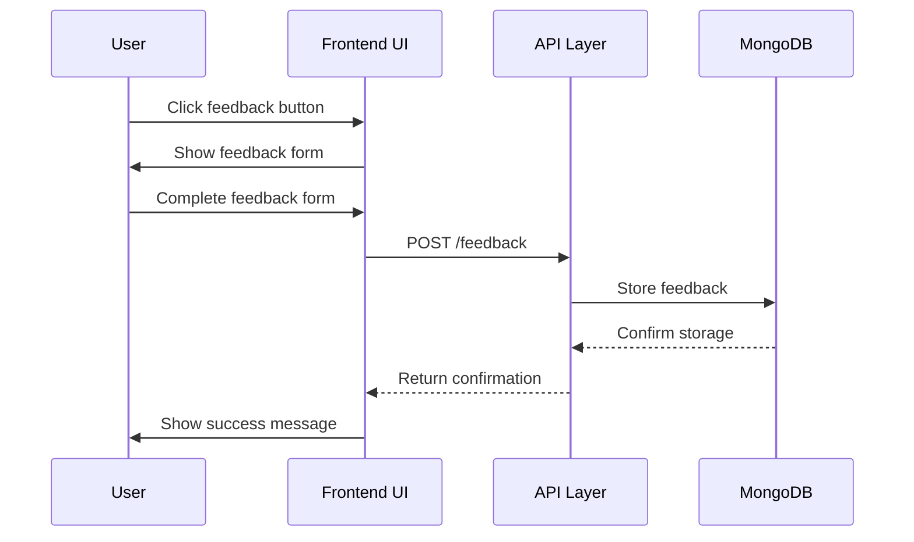

> **Superseded (2026-09-22).** This document describes the original May 2025 design and is kept for history only. The current domain language is in [`CONTEXT.md`](../CONTEXT.md), decisions are in [`docs/adr/`](adr/), and requirements are in [`docs/PRD.md`](PRD.md).

# swagger.bot Architecture Document

## Introduction / Preamble

This document outlines the overall architecture for the swagger.bot project, including backend systems, shared services, and non-UI specific concerns. Its primary goal is to serve as the guiding architectural blueprint for AI-driven development, ensuring consistency and adherence to chosen patterns and technologies.

**Relationship to Frontend Architecture:**
While this document covers the core technology stack choices that are definitive for the entire project, a separate Frontend Architecture Document will be created by the Design Architect to detail the frontend-specific design. The frontend architecture will build upon the foundation established in this document, particularly focusing on the UI components, state management patterns, and user interaction flows outlined in the UX/UI specification.

## Table of Contents

- [Technical Summary](#technical-summary)
- [High-Level Overview](#high-level-overview)
- [Architectural / Design Patterns Adopted](#architectural--design-patterns-adopted)
- [Component View](#component-view)
- [Project Structure](#project-structure)
- [API Reference](#api-reference)
- [Data Models](#data-models)
- [Core Workflow / Sequence Diagrams](#core-workflow--sequence-diagrams)
- [Definitive Tech Stack Selections](#definitive-tech-stack-selections)
- [Infrastructure and Deployment Overview](#infrastructure-and-deployment-overview)
- [Error Handling Strategy](#error-handling-strategy)
- [Coding Standards](#coding-standards)
- [Overall Testing Strategy](#overall-testing-strategy)
- [Security Best Practices](#security-best-practices)
- [Key Reference Documents](#key-reference-documents)
- [Change Log](#change-log)

## Technical Summary

swagger.bot is a specialized tool designed to discover, validate, and enrich OpenAPI/Swagger specifications for public APIs. The system employs a multi-strategy search approach, combining web search capabilities, common path probing, and direct domain scanning to locate API specifications. Once discovered, these specifications are validated, parsed, and enhanced with AI-generated summaries to provide developers with immediately useful resources.

The architecture follows a modular monolith pattern implemented as a TypeScript monorepo, with clear separation between the core discovery engine, validation system, AI enrichment pipeline, and presentation layer. The system leverages LangGraph JS for workflow orchestration, managing the complex process from initial search to final response delivery. This architecture is designed to meet the performance requirement of completing the entire discovery and processing workflow in under 30 seconds while maintaining flexibility, reliability, and scalability.

## High-Level Overview

The swagger.bot system follows a **Modular Monolith** architectural style, with all components deployed as a single application but organized into distinct, loosely-coupled modules. This approach was chosen to balance development simplicity with clear separation of concerns. The system is organized as a **Monorepo** to facilitate code sharing and consistent versioning across components.



The primary user interaction flow begins with a search query for an API specification, which triggers the LangGraph orchestrated workflow. This workflow coordinates the discovery process across multiple search strategies, validates any found specifications, enriches them with AI-generated summaries, and formats the response according to user preferences. The entire process is designed to be completed within 30 seconds, with real-time progress updates provided to the user.

## Architectural / Design Patterns Adopted

- **Orchestrator Pattern:** LangGraph JS serves as the central orchestrator, managing the workflow from discovery to response. This pattern provides clear visibility into the process state, enables retries and fallbacks, and ensures proper error handling. _Rationale:_ Complex workflows with multiple potential paths and external service dependencies require centralized coordination.

- **Repository Pattern:** Data access is abstracted through repository interfaces, isolating the data storage implementation from the business logic. _Rationale:_ Provides a clean separation between domain logic and data access, facilitating testing and potential future database changes.

- **Adapter Pattern:** External services (search APIs, LLM providers) are accessed through adapter interfaces that normalize their behavior. _Rationale:_ Isolates the system from external API changes and allows for easy substitution of service providers.

- **Strategy Pattern:** The discovery engine employs multiple search strategies that can be executed in parallel or sequentially based on configuration. _Rationale:_ Different APIs may require different discovery approaches, and this pattern allows for flexible composition of search methods.

- **Factory Pattern:** Used for creating appropriate validators, parsers, and formatters based on specification versions and formats. _Rationale:_ Encapsulates the creation logic for these components, making it easier to support multiple specification versions and formats.

- **Observer Pattern:** Implemented for real-time progress updates during the discovery and processing workflow. _Rationale:_ Enables asynchronous notification of state changes without tight coupling between components.

## Component View

The swagger.bot system is composed of several major logical components, each with distinct responsibilities:

### Discovery Engine

- **Responsibility:** Implements multiple strategies to find OpenAPI/Swagger specifications for a given API or service name.
- **Key Features:**
  - Web search using Browserbase + Stagehand
  - Intelligent search queries via Perplexity API
  - Common path probing for standard documentation locations
  - Direct domain scanning
  - Strategy coordination and prioritization



### Validation System

- **Responsibility:** Validates discovered specifications against OpenAPI/Swagger standards and normalizes them to a consistent format.
- **Key Features:**
  - Support for OpenAPI v3 and Swagger v2
  - Format detection and conversion (JSON/YAML)
  - Schema validation
  - Metadata extraction
  - Error reporting

### Enrichment Service

- **Responsibility:** Generates human-readable summaries and insights from validated API specifications.
- **Key Features:**
  - Integration with OpenRouter for LLM access
  - Summary generation with key endpoint highlighting
  - Use case identification
  - Content source tracking (AI vs. extracted)
  - Caching of generated content

### LangGraph Orchestrator

- **Responsibility:** Manages the end-to-end workflow from discovery to response delivery.
- **Key Features:**
  - State persistence in MongoDB
  - Workflow definition with decision points
  - Error handling and recovery
  - Timeout and retry mechanisms
  - Progress tracking and reporting

### Response Formatter

- **Responsibility:** Delivers results in the user's preferred format.
- **Key Features:**
  - Raw specification formatting (JSON/YAML)
  - Markdown summary generation
  - Structured JSON response creation
  - Confidence score inclusion
  - Source information tracking

### API Layer

- **Responsibility:** Exposes the system's capabilities through RESTful endpoints.
- **Key Features:**
  - Request validation
  - Authentication (if needed in future)
  - Rate limiting
  - Error handling
  - Response formatting

### Frontend Application

- **Responsibility:** Provides the user interface for interacting with the system.
- **Key Features:**
  - Search interface
  - Results dashboard
  - Specification explorer
  - Summary view
  - Progress indicators

## Project Structure

The swagger.bot project follows a monorepo structure with layer-based organization:

````plaintext
swagger.bot/
├── .github/                    # CI/CD workflows
│   └── workflows/
│       └── main.yml
├── .vscode/                    # VSCode settings
│   └── settings.json
├── api/                        # Express API routes and controllers
│   ├── routes/                 # API endpoint definitions
│   ├── controllers/            # Request handlers
│   ├── middleware/             # Express middleware
│   └── validators/             # Request validation
├── core/                       # Core business logic and domain models
│   ├── discovery/              # API spec discovery engine
│   │   ├── strategies/         # Implementation of search strategies
│   │   ├── adapters/           # Adapters for search services
│   │   └── coordinator.ts      # Strategy coordination
│   ├── validation/             # Spec validation and parsing
│   │   ├── validators/         # Version-specific validators
│   │   ├── parsers/            # Format parsers (JSON/YAML)
│   │   └── normalizers/        # Format normalizers
│   ├── enrichment/             # AI-powered summarization
│   │   ├── llm/                # LLM service adapters
│   │   ├── prompts/            # Prompt templates
│   │   └── generators/         # Content generators
│   ├── models/                 # Domain models and types
│   │   ├── specification.ts    # Specification model
│   │   ├── search-result.ts    # Search result model
│   │   └── summary.ts          # Summary model
│   └── utils/                  # Shared utilities
├── ui/                         # React frontend application
│   ├── components/             # Reusable UI components
│   │   ├── search/             # Search-related components
│   │   ├── results/            # Result display components
│   │   ├── explorer/           # Specification explorer components
│   │   └── common/             # Common UI components
│   ├── pages/                  # Page components
│   ├── hooks/                  # Custom React hooks
│   ├── context/                # React context providers
│   └── styles/                 # Tailwind and CSS styles
├── services/                   # External service integrations
│   ├── search/                 # Search service integrations
│   │   ├── browserbase.ts      # Browserbase + Stagehand integration
│   │   └── perplexity.ts       # Perplexity API integration
│   ├── ai/                     # AI service integrations
│   │   └── openrouter.ts       # OpenRouter integration
│   ├── langgraph/              # LangGraph workflow definitions
│   │   ├── nodes/              # Workflow nodes
│   │   ├── workflows/          # Complete workflow definitions
│   │   └── state.ts            # State management
│   └── database/               # MongoDB data access layer
│       ├── repositories/       # Data repositories
│       ├── models/             # Database models
│       └── connection.ts       # Database connection
├── config/                     # Configuration files
│   ├── default.ts              # Default configuration
│   ├── development.ts          # Development configuration
│   └── production.ts           # Production configuration
├── scripts/                    # Build and deployment scripts
├── tests/                      # Test files
│   ├── unit/                   # Unit tests
│   ├── integration/            # Integration tests
│   └── e2e/                    # End-to-end tests
├── docs/                       # Documentation
│   ├── swagger.bot-project-brief.md    # Project brief
## API Reference

### External APIs Consumed

#### Browserbase + Stagehand API

- **Purpose:** Enables browser-based discovery of API specifications through web page interaction and content extraction.
- **Base URL(s):**
  - Production: `https://api.browserbase.com/v1`
- **Authentication:** API Key in Header (Header Name: `X-API-Key`). Reference `config/default.ts` for key name.
- **Key Endpoints Used:**
  - **`POST /browser/start`:**
    - Description: Starts a new browser session
    - Request Body Schema: `{ options: { headless: boolean } }`
    - Success Response Schema (Code: `200 OK`): `{ browserId: string }`
  - **`POST /browser/{browserId}/navigate`:**
    - Description: Navigates to a URL
    - Request Body Schema: `{ url: string }`
    - Success Response Schema (Code: `200 OK`): `{ status: string }`
  - **`POST /browser/{browserId}/extract`:**
    - Description: Extracts content from the current page
    - Request Body Schema: `{ selector: string }`
    - Success Response Schema (Code: `200 OK`): `{ content: string }`
- **Rate Limits:** To be determined based on service tier
- **Link to Official Docs:** https://docs.browserbase.com

#### Perplexity API

- **Purpose:** Provides intelligent search capabilities to find API specifications through natural language understanding.
- **Base URL(s):**
  - Production: `https://api.perplexity.ai`
- **Authentication:** API Key in Header (Header Name: `Authorization`). Reference `config/default.ts` for key name.
- **Key Endpoints Used:**
  - **`POST /search`:**
    - Description: Performs a search query
    - Request Body Schema: `{ query: string, max_results: number }`
    - Success Response Schema (Code: `200 OK`): `{ results: Array<{ title: string, url: string, snippet: string }> }`
- **Rate Limits:** Depends on subscription tier
- **Link to Official Docs:** https://docs.perplexity.ai

#### OpenRouter API

- **Purpose:** Provides access to various LLMs for generating summaries and insights from API specifications.
- **Base URL(s):**
  - Production: `https://openrouter.ai/api/v1`
- **Authentication:** API Key in Header (Header Name: `Authorization`). Reference `config/default.ts` for key name.
- **Key Endpoints Used:**
  - **`POST /chat/completions`:**
    - Description: Generates text completions based on prompts
    - Request Body Schema:
      ```json
      {
        "model": "string",
        "messages": [
          {
            "role": "system|user|assistant",
            "content": "string"
          }
        ],
        "temperature": number,
        "max_tokens": number
      }
      ```
    - Success Response Schema (Code: `200 OK`):
      ```json
      {
        "id": "string",
        "choices": [
          {
            "message": {
              "role": "assistant",
              "content": "string"
            }
          }
        ],
        "usage": {
          "prompt_tokens": number,
          "completion_tokens": number,
          "total_tokens": number
        }
      }
      ```
- **Rate Limits:** Depends on subscription tier
- **Link to Official Docs:** https://openrouter.ai/docs

### Internal APIs Provided

#### swagger.bot API

- **Purpose:** Provides access to the swagger.bot functionality for discovering and processing API specifications.
- **Base URL(s):** `/api/v1`
- **Authentication/Authorization:** None for MVP (public access)
- **Endpoints:**
  - **`POST /search`:**
    - Description: Initiates a search for API specifications
    - Request Parameters: None
    - Request Body Schema:
      ```typescript
      {
        query: string;              // API or service name to search for
        strategies?: {              // Optional strategy configuration
          webSearch: boolean;       // Enable/disable web search
          pathProbing: boolean;     // Enable/disable path probing
          domainScan: boolean;      // Enable/disable domain scanning
        };
        responseFormat?: 'json' | 'yaml' | 'markdown'; // Preferred response format
      }
      ```
    - Success Response Schema (Code: `200 OK`):
      ```typescript
      {
        requestId: string;          // Unique identifier for the request
        status: 'pending';          // Initial status
        estimatedTimeSeconds: number; // Estimated time to completion
      }
      ```
    - Error Response Schema (Code: `400 Bad Request`):
      ```typescript
      {
        error: string;              // Error message
        details?: any;              // Optional error details
      }
      ```

  - **`GET /search/{requestId}/status`:**
    - Description: Checks the status of a search request
    - Request Parameters: `requestId` (path)
    - Success Response Schema (Code: `200 OK`):
      ```typescript
      {
        requestId: string;
        status: 'pending' | 'processing' | 'completed' | 'failed';
        progress: {
          overall: number;          // 0-100 percentage
          currentStage: string;     // e.g., "discovery", "validation", "enrichment"
          stageProgress: number;    // 0-100 percentage
          message: string;          // Human-readable status message
        };
        estimatedTimeSeconds?: number; // Only present if status is 'pending' or 'processing'
        result?: {                  // Only present if status is 'completed'
          specifications: Array<{
            id: string;
            title: string;
            version: string;
            format: 'json' | 'yaml';
            confidence: number;     // 0-1 confidence score
            source: string;         // Where the spec was found
            url?: string;           // Original URL if available
          }>;
        };
        error?: {                   // Only present if status is 'failed'
          message: string;
          code: string;
## Data Models

### Core Application Entities / Domain Objects

#### Specification

- **Description:** Represents an OpenAPI/Swagger specification discovered and processed by the system.
- **Schema / Interface Definition:**
  ```typescript
  export interface Specification {
    id: string;                     // Unique identifier
    title: string;                  // API title from the spec
    version: string;                // API version from the spec
    description?: string;           // API description from the spec
    specVersion: 'swagger_2' | 'openapi_3'; // Specification format version
    format: 'json' | 'yaml';        // File format
    content: any;                   // The actual specification content
    endpoints: Array<{
      path: string;                 // Endpoint path
      method: string;               // HTTP method
      operationId?: string;         // Operation ID if available
      summary?: string;             // Endpoint summary
      description?: string;         // Endpoint description
      parameters?: Array<{
        name: string;               // Parameter name
        in: string;                 // Parameter location (path, query, header, etc.)
        required: boolean;          // Whether parameter is required
        type: string;               // Parameter type
        description?: string;       // Parameter description
      }>;
      requestBody?: any;            // Request body schema if applicable
      responses: Record<string, any>; // Response schemas by status code
    }>;
    securitySchemes?: Array<{
      type: string;                 // Security scheme type
      name?: string;                // Name if applicable
      description?: string;         // Description if available
    }>;
    metadata: {
      confidence: number;           // Confidence score (0-1)
      source: string;               // Where the spec was found
      discoveryMethod: string;      // Method used to discover the spec
      discoveredAt: Date;           // When the spec was discovered
      url?: string;                 // Original URL if available
      validationResult: {
        valid: boolean;             // Whether the spec is valid
        errors?: Array<{
          path: string;             // Path to the error
          message: string;          // Error message
          severity: 'error' | 'warning'; // Error severity
        }>;
      };
    };
  }
  ```
- **Validation Rules:**
  - `id` must be a valid UUID
  - `title` and `version` are required and must be non-empty strings
  - `confidence` must be between 0 and 1
  - `discoveredAt` must be a valid date

#### SearchRequest

- **Description:** Represents a user's request to search for API specifications.
- **Schema / Interface Definition:**
  ```typescript
  export interface SearchRequest {
    id: string;                     // Unique identifier
    query: string;                  // API or service name to search for
    strategies: {                   // Search strategies configuration
      webSearch: boolean;           // Whether to use web search
      pathProbing: boolean;         // Whether to use path probing
      domainScan: boolean;          // Whether to use domain scanning
    };
    responseFormat: 'json' | 'yaml' | 'markdown'; // Preferred response format
    status: 'pending' | 'processing' | 'completed' | 'failed'; // Current status
    progress: {
      overall: number;              // 0-100 percentage
      currentStage: string;         // Current processing stage
      stageProgress: number;        // 0-100 percentage for current stage
      message: string;              // Human-readable status message
    };
    startedAt: Date;                // When the request was started
    completedAt?: Date;             // When the request was completed
    results?: Array<string>;        // IDs of discovered specifications
    error?: {
      message: string;              // Error message
      code: string;                 // Error code
      details?: any;                // Error details
    };
  }
  ```
- **Validation Rules:**
  - `id` must be a valid UUID
  - `query` must be a non-empty string with at least 3 characters
  - `overall` and `stageProgress` must be between 0 and 100
  - `startedAt` must be a valid date

#### Summary

- **Description:** Represents an AI-generated summary of an API specification.
- **Schema / Interface Definition:**
  ```typescript
  export interface Summary {
    id: string;                     // Unique identifier
    specificationId: string;        // Reference to the specification
    overview: string;               // General overview of the API
    keyEndpoints: Array<{
      path: string;                 // Endpoint path
      method: string;               // HTTP method
      description: string;          // Endpoint description
      importance: number;           // Importance score (0-1)
      parameters?: Array<{
        name: string;               // Parameter name
        type: string;               // Parameter type
        required: boolean;          // Whether parameter is required
        description?: string;       // Parameter description
      }>;
    }>;
    authenticationRequirements?: string; // Authentication requirements
    potentialUseCases?: Array<string>; // Potential use cases
    metadata: {
      generatedAt: Date;            // When the summary was generated
      model: string;                // LLM model used
      confidence: number;           // Confidence score (0-1)
    };
  }
  ```
- **Validation Rules:**
  - `id` and `specificationId` must be valid UUIDs
  - `overview` must be a non-empty string
  - `keyEndpoints` must have at least one entry
  - `confidence` must be between 0 and 1
  - `generatedAt` must be a valid date

### Database Schemas

#### Specifications Collection

- **Purpose:** Stores discovered and processed API specifications.
- **Schema Definition:**
  ```typescript
  // MongoDB Schema
  const SpecificationSchema = new Schema({
    _id: { type: String, default: () => uuidv4() },
    title: { type: String, required: true },
    version: { type: String, required: true },
    description: { type: String },
    specVersion: { type: String, enum: ['swagger_2', 'openapi_3'], required: true },
    format: { type: String, enum: ['json', 'yaml'], required: true },
    content: { type: Schema.Types.Mixed, required: true },
    endpoints: [{
      path: { type: String, required: true },
      method: { type: String, required: true },
      operationId: { type: String },
      summary: { type: String },
      description: { type: String },
      parameters: [{
        name: { type: String, required: true },
        in: { type: String, required: true },
        required: { type: Boolean, required: true },
        type: { type: String, required: true },
        description: { type: String }
      }],
      requestBody: { type: Schema.Types.Mixed },
      responses: { type: Schema.Types.Mixed, required: true }
    }],
    securitySchemes: [{
      type: { type: String, required: true },
      name: { type: String },
      description: { type: String }
    }],
    metadata: {
      confidence: { type: Number, required: true, min: 0, max: 1 },
      source: { type: String, required: true },
      discoveryMethod: { type: String, required: true },
      discoveredAt: { type: Date, required: true, default: Date.now },
      url: { type: String },
      validationResult: {
        valid: { type: Boolean, required: true },
        errors: [{
          path: { type: String, required: true },
          message: { type: String, required: true },
          severity: { type: String, enum: ['error', 'warning'], required: true }
        }]
      }
    }
  });
  ```

#### SearchRequests Collection

- **Purpose:** Tracks user search requests and their status.
- **Schema Definition:**
  ```typescript
  // MongoDB Schema
  const SearchRequestSchema = new Schema({
    _id: { type: String, default: () => uuidv4() },
    query: { type: String, required: true },
    strategies: {
      webSearch: { type: Boolean, required: true, default: true },
      pathProbing: { type: Boolean, required: true, default: true },
      domainScan: { type: Boolean, required: true, default: false }
    },
## Core Workflow / Sequence Diagrams

### Main Search Workflow



### Error Handling Workflow

```mermaid
sequenceDiagram
    participant User
    participant UI as Frontend UI
    participant API as API Layer
    participant LG as LangGraph Orchestrator
    participant DE as Discovery Engine
    participant DB as MongoDB

    User->>UI: Enter API name & search options
    UI->>API: POST /search
    API->>LG: Initiate search workflow
    LG->>DB: Create search request record
    DB-->>LG: Return request ID
    LG-->>API: Return request ID & status
    API-->>UI: Return request ID & status
    UI->>User: Show search in progress

    LG->>DE: Execute search strategies

    alt No specifications found
        DE-->>LG: Return empty results
        LG->>LG: Attempt fallback strategies
        LG->>LG: Still no results
        LG->>DB: Update status to failed with error
        DB-->>LG: Confirm update
    else External service error
        DE--xLG: Throw service error
        LG->>LG: Retry with exponential backoff
        LG->>LG: Max retries exceeded
        LG->>DB: Update status to failed with error
        DB-->>LG: Confirm update
    else Validation error
        DE-->>LG: Return discovered specifications
        LG->>VS: Validate specifications
        VS--xLG: Throw validation error
        LG->>LG: Attempt to fix common issues
        LG->>DB: Update status with validation warnings
## Definitive Tech Stack Selections

| Category             | Technology              | Version / Details | Description / Purpose                   | Justification |
| :------------------- | :---------------------- | :---------------- | :-------------------------------------- | :----------------------- |
| **Languages**        | TypeScript              | 5.0.x             | Primary language for backend/frontend   | Type safety, developer experience, and consistency across the stack |
| **Runtime**          | Node.js                 | 20.x LTS          | Server-side execution environment       | Stable LTS version with good performance and compatibility |
| **Frameworks**       | Express                 | 4.18.x            | Backend API framework                   | Mature, flexible, and widely adopted with extensive middleware ecosystem |
|                      | React                   | 18.x              | Frontend UI library                     | Component-based architecture, robust ecosystem, and developer familiarity |
| **Databases**        | MongoDB                 | 6.0.x             | Primary document database               | Flexible schema for storing varied specification formats, good fit for JSON/YAML data |
| **UI Libraries**     | Tailwind CSS            | 3.3.x             | Utility-first CSS framework            | Rapid UI development with consistent design system |
|                      | shadcn/ui               | Latest            | Component library                       | High-quality, accessible components built on Radix UI primitives |
| **State Management** | React Query             | 5.x               | Data fetching and state management      | Efficient data fetching, caching, and synchronization |
|                      | Zustand                 | 4.x               | Global state management                 | Simple, lightweight alternative to Redux for global state |
| **Search Services**  | Browserbase + Stagehand | Latest            | Browser-based discovery                 | Enables web scraping and content extraction from browser context |
|                      | Perplexity API          | Latest            | Intelligent search queries              | AI-powered search for finding relevant API documentation |
| **AI Services**      | OpenRouter              | Latest            | LLM access                              | Flexible access to various LLMs with unified API |
| **Orchestration**    | LangGraph JS            | Latest            | Workflow orchestration                  | Directed workflow management with state persistence |
| **API Validation**   | Swagger Parser          | 10.x              | OpenAPI/Swagger validation              | Comprehensive validation for both v2 and v3 specifications |
|                      | Zod                     | 3.x               | Runtime type validation                 | Type-safe schema validation for API requests/responses |
| **Testing**          | Jest                    | 29.x              | Unit/Integration testing framework      | Comprehensive testing framework with good TypeScript support |
|                      | Testing Library         | Latest            | Component testing                       | Testing components from a user perspective |
|                      | Playwright              | 1.40.x+           | End-to-end testing                      | Modern, reliable browser automation for E2E tests |
| **Build Tools**      | Vite                    | 5.x               | Frontend build tool                     | Fast development server and optimized production builds |
|                      | tsup                    | Latest            | TypeScript build tool                   | Simple TypeScript bundler for backend code |
| **Infrastructure**   | Docker                  | Latest            | Containerization                        | Consistent development and deployment environments |
|                      | Coolify                 | Latest            | Self-hosted PaaS                        | Simple deployment platform with Docker support |
| **CI/CD**            | GitHub Actions          | Latest            | Continuous Integration/Deployment       | Integrated with GitHub, flexible workflow configuration |
| **Monitoring**       | Winston                 | 3.x               | Logging                                 | Flexible, configurable logging with multiple transports |
|                      | Prometheus + Grafana    | Latest            | Metrics and monitoring                  | Industry standard for metrics collection and visualization |
| **Documentation**    | TypeDoc                 | Latest            | API documentation                       | Generate documentation from TypeScript code |
|                      | Storybook               | 7.x               | Component documentation                 | Interactive component documentation and testing |

## Infrastructure and Deployment Overview

- **Cloud Provider(s):** Self-hosted on Coolify
- **Core Services Used:** Docker containers, MongoDB
- **Infrastructure as Code (IaC):** Docker Compose for local development and production deployment
- **Deployment Strategy:** CI/CD pipeline with GitHub Actions
  - Automated tests on pull requests
  - Automated deployment to staging on merge to develop branch
  - Manual promotion to production after approval
- **Environments:**
  - Development (local)
  - Staging
  - Production
- **Environment Promotion:** `development` -> `staging` (automated on merge to develop) -> `production` (manual approval)
- **Rollback Strategy:** Docker image versioning with ability to revert to previous image version

## Error Handling Strategy

- **General Approach:** Use structured error objects with error codes, messages, and optional details. Implement centralized error handling middleware for API requests.

- **Logging:**
  - **Library/Method:** Winston for structured logging
  - **Format:** JSON format for machine readability
  - **Levels:** ERROR, WARN, INFO, DEBUG, VERBOSE
    - ERROR: Application errors that require immediate attention
    - WARN: Potential issues that don't prevent operation but may indicate problems
    - INFO: Important application events (startup, shutdown, significant operations)
    - DEBUG: Detailed information useful for debugging
    - VERBOSE: Very detailed information for tracing execution flow
  - **Context:** Each log entry must include:
    - Timestamp
    - Correlation ID (for request tracing)
    - Component/Module name
    - Operation name
    - Relevant non-sensitive parameters

- **Specific Handling Patterns:**
  - **External API Calls:**
    - Implement retry mechanism with exponential backoff (max 3 retries)
    - Use circuit breaker pattern with `opossum` library
    - Set reasonable timeouts (5s connect, 30s read)
    - Standardize error responses with the following structure:
      ```typescript
      {
        error: string;       // Error code
        message: string;     // Human-readable message
        details?: any;       // Additional error details
        requestId?: string;  // For tracking/support
      }
      ```

  - **Internal Errors / Business Logic Exceptions:**
    - Create domain-specific error classes extending a base `AppError`
    - Include error codes for all business logic errors
    - Map internal errors to appropriate HTTP status codes
    - Sanitize error details in production to avoid leaking sensitive information

  - **Transaction Management:**
    - Use MongoDB transactions for operations that modify multiple documents
    - Implement compensating actions for operations that can't be rolled back
    - Log all transaction failures with detailed context for debugging

## Coding Standards

- **Primary Runtime(s):** Node.js 20.x LTS
- **Style Guide & Linter:** ESLint with TypeScript plugin + Prettier
  - Configuration files: `.eslintrc.js`, `.prettierrc`
  - Linting runs on pre-commit hooks and in CI pipeline
  - No disabling of linter rules without documented justification

- **Naming Conventions:**
  - Variables: `camelCase`
  - Functions/Methods: `camelCase`
  - Classes/Types/Interfaces: `PascalCase`
  - Constants: `UPPER_SNAKE_CASE`
  - Files: `kebab-case.ts` for implementation files, `kebab-case.test.ts` for test files
  - Modules/Packages: `camelCase`

- **File Structure:** Adhere to the layout defined in the "Project Structure" section.

- **Unit Test File Organization:** `*.test.ts` files co-located with the source files they test.

- **Asynchronous Operations:**
  - Always use `async`/`await` for promise-based operations
  - Properly handle promise rejections with try/catch blocks
  - Avoid nested promises and callback patterns

- **Type Safety:**
  - Enable TypeScript strict mode with all flags
  - Avoid using `any` type; use `unknown` when type is truly unknown
  - Use generics appropriately for reusable components
  - Define explicit return types for public functions and methods
  - Use Zod for runtime validation of external data

- **Comments & Documentation:**
  - Code Comments: Focus on explaining "why" not "what"
  - Use JSDoc format for function/method documentation
  - Each module should have a brief comment explaining its purpose
  - Document complex algorithms and business logic
  - Keep comments up-to-date with code changes

- **Dependency Management:**
  - Use npm with package-lock.json
  - Pin exact versions for production dependencies (`"package": "1.2.3"` not `"^1.2.3"`)
  - Regularly update dependencies for security patches
  - Minimize dependencies and prefer established libraries

### Detailed Language & Framework Conventions

#### TypeScript/Node.js Specifics:

- **Immutability:** Prefer immutable data structures. Use `readonly` modifiers, `as const` for object/array literals, and avoid direct mutation of objects.

- **Functional vs. OOP:** Use a balanced approach:
  - Prefer functional programming for data transformations (map, filter, reduce)
  - Use classes for services, repositories, and entities with clear responsibilities
  - Avoid deep inheritance hierarchies; prefer composition over inheritance

- **Error Handling Specifics:**
  - Create custom error classes extending `Error`
  - Include error codes, messages, and optional details
  - Ensure stack traces are preserved when re-throwing errors
  - Use consistent error patterns across the application

- **Null/Undefined Handling:**
  - Enable `strictNullChecks`
  - Use optional chaining (`?.`) and nullish coalescing (`??`) operators
  - Avoid non-null assertion operator (`!`) when possible
  - Validate function inputs at boundaries

- **Module System:** Use ES Modules (`import`/`export`) exclusively.

- **Logging Specifics:**
  - Use Winston for structured logging
  - Configure log levels based on environment
  - Avoid logging sensitive information
  - Include context information in all log entries

- **Express Idioms:**
  - Use middleware for cross-cutting concerns
  - Implement controller-service-repository pattern
  - Use typed request/response objects with Express
  - Centralize error handling with middleware

- **Key Library Usage Conventions:**
  - Create configured axios instances for external API calls
  - Use dayjs for date/time manipulation
  - Implement repository pattern for database access
  - Use dependency injection for services

- **Code Generation Anti-Patterns to Avoid:**
  - Avoid deeply nested conditional logic (max 3 levels)
  - Avoid large functions (>50 lines)
  - Avoid duplicated code; extract to shared functions
  - Avoid magic strings/numbers; use constants

#### React Specifics:

- **Component Structure:**
  - Prefer functional components with hooks
  - Co-locate component files with their styles and tests
  - Split large components into smaller, focused components
  - Use React.memo for performance optimization when appropriate

- **State Management:**
  - Use React Query for server state
  - Use Zustand for global UI state
  - Use local state (useState) for component-specific state
  - Avoid prop drilling; use context or state management libraries

- **Performance Considerations:**
  - Memoize expensive calculations with useMemo
  - Optimize event handlers with useCallback
  - Use virtualization for long lists (react-window)
  - Implement code splitting with React.lazy

- **Accessibility:**
  - Use semantic HTML elements
  - Implement proper ARIA attributes
  - Ensure keyboard navigation works
  - Test with screen readers

## Overall Testing Strategy

- **Tools:** Jest, Testing Library, Playwright

- **Unit Tests:**
  - **Scope:** Individual functions, methods, classes, and components
  - **Location:** Co-located with source files (`*.test.ts`)
  - **Mocking/Stubbing:** Jest mocks for external dependencies
  - **Coverage Target:** 80% line coverage for core business logic

- **Integration Tests:**
  - **Scope:** API endpoints, service interactions, database operations
  - **Location:** `/tests/integration` directory
  - **Environment:** In-memory MongoDB for database tests
  - **Coverage:** All API endpoints must have integration tests

- **End-to-End (E2E) Tests:**
  - **Scope:** Critical user flows and scenarios
  - **Tools:** Playwright
  - **Location:** `/tests/e2e` directory
  - **Coverage:** Core user journeys must have E2E tests

- **Test Data Management:**
  - Use factory functions to generate test data
  - Implement database seeding for integration tests
  - Reset test state between test runs
  - Use realistic but anonymized data for testing

## Security Best Practices

- **Input Sanitization/Validation:**
  - Validate all API inputs using Zod schemas
  - Implement validation middleware for all API routes
  - Sanitize user-provided content before storage or display
  - Validate query parameters and URL parameters

- **Output Encoding:**
  - Use React's built-in XSS protection for frontend
  - Implement Content-Security-Policy headers
  - Set appropriate response headers (X-Content-Type-Options, etc.)
  - Sanitize API responses when including user-generated content

- **Secrets Management:**
  - Store secrets in environment variables
  - Use .env files for local development (not committed to source control)
  - Implement a secrets management service for production
  - Rotate secrets regularly

- **Dependency Security:**
  - Run npm audit as part of CI pipeline
  - Use Dependabot for automated security updates
  - Regularly update dependencies
  - Minimize dependencies and prefer established libraries

- **Authentication/Authorization Checks:**
  - Implement authentication middleware for protected routes
  - Use role-based access control for authorization
  - Validate permissions at the service layer
  - Implement proper session management

- **Principle of Least Privilege:**
  - Use dedicated database users with minimal permissions
  - Implement fine-grained access control
  - Limit scope of API keys and tokens
  - Use separate service accounts for different components

- **API Security:**
  - Implement rate limiting and throttling
  - Use HTTPS for all communications
  - Set secure HTTP headers (HSTS, CSP, etc.)
  - Implement proper CORS configuration

- **Error Handling & Information Disclosure:**
  - Sanitize error messages in production
  - Avoid exposing stack traces or internal paths
  - Log detailed errors server-side
  - Return generic error messages to clients

## Key Reference Documents

- [swagger.bot Project Brief](./swagger.bot-project-brief.md)
- [swagger.bot PRD](./swagger.bot-prd.md)
- [swagger.bot UX/UI Specification](./swagger.bot-uxui-spec.md)

## Change Log

| Change | Date | Version | Description | Author |
| ------ | ---- | ------- | ----------- | ------ |
| Initial Creation | 2025-05-21 | 1.0.0 | Initial architecture document | Mo (Architect) |

--- Below, Prompt for Design Architect (Millie) To Produce Front End Architecture ----

# Frontend Architecture Next Steps

The swagger.bot architecture is now defined with a clear technical foundation. The next critical step is to engage the **Design Architect (Millie)** to create a detailed **Frontend Architecture** document that builds upon this foundation.

The Frontend Architecture should focus on:

1. Detailed component hierarchy and organization
2. State management patterns and data flow
3. UI component library implementation details
4. Responsive design approach
5. Accessibility implementation
6. Frontend performance optimization strategies

Millie should use both this Architecture Document and the UX/UI Specification as primary inputs to ensure the frontend architecture aligns with both the technical foundation and the user experience goals.
        DB-->>LG: Confirm update
    end

    UI->>API: GET /search/{requestId}/status (polling)
    API->>DB: Query search request status
    DB-->>API: Return error status
    API-->>UI: Return error details
    UI->>User: Display error with suggestions

    opt User provides feedback
        User->>UI: Submit feedback on error
        UI->>API: POST /feedback
        API->>DB: Store feedback
        DB-->>API: Confirm storage
        API-->>UI: Confirm feedback received
        UI->>User: Show confirmation
    end
```

### Feedback Submission Workflow


    responseFormat: { type: String, enum: ['json', 'yaml', 'markdown'], required: true, default: 'json' },
    status: {
      type: String,
      enum: ['pending', 'processing', 'completed', 'failed'],
      required: true,
      default: 'pending'
    },
    progress: {
      overall: { type: Number, required: true, min: 0, max: 100, default: 0 },
      currentStage: { type: String, required: true, default: 'initializing' },
      stageProgress: { type: Number, required: true, min: 0, max: 100, default: 0 },
      message: { type: String, required: true, default: 'Request initialized' }
    },
    startedAt: { type: Date, required: true, default: Date.now },
    completedAt: { type: Date },
    results: [{ type: String, ref: 'Specification' }],
    error: {
      message: { type: String },
      code: { type: String },
      details: { type: Schema.Types.Mixed }
    }
  });
  ```

#### Summaries Collection

- **Purpose:** Stores AI-generated summaries of API specifications.
- **Schema Definition:**
  ```typescript
  // MongoDB Schema
  const SummarySchema = new Schema({
    _id: { type: String, default: () => uuidv4() },
    specificationId: { type: String, ref: 'Specification', required: true },
    overview: { type: String, required: true },
    keyEndpoints: [{
      path: { type: String, required: true },
      method: { type: String, required: true },
      description: { type: String, required: true },
      importance: { type: Number, required: true, min: 0, max: 1 },
      parameters: [{
        name: { type: String, required: true },
        type: { type: String, required: true },
        required: { type: Boolean, required: true },
        description: { type: String }
      }]
    }],
    authenticationRequirements: { type: String },
    potentialUseCases: [{ type: String }],
    metadata: {
      generatedAt: { type: Date, required: true, default: Date.now },
      model: { type: String, required: true },
      confidence: { type: Number, required: true, min: 0, max: 1 }
    }
  });
  ```
          details?: any;
        };
      }
      ```

  - **`GET /specification/{specId}`:**
    - Description: Retrieves a specific specification
    - Request Parameters:
      - `specId` (path)
      - `format` (query, optional): 'json' | 'yaml' | 'markdown'
    - Success Response Schema (Code: `200 OK`):
      - If format is 'json' or 'yaml': Raw specification content
      - If format is 'markdown' or not specified:
        ```typescript
        {
          specification: {
            id: string;
            title: string;
            version: string;
            description?: string;
            content: any;           // The specification content
          };
          summary?: {               // Only present if AI summary was generated
            overview: string;
            keyEndpoints: Array<{
              path: string;
              method: string;
              description: string;
              parameters?: Array<{
                name: string;
                type: string;
                required: boolean;
                description?: string;
              }>;
            }>;
            authenticationRequirements?: string;
            potentialUseCases?: Array<string>;
          };
          metadata: {
            confidence: number;
            source: string;
            discoveredAt: string;   // ISO date string
            url?: string;
          };
        }
        ```

  - **`POST /feedback`:**
    - Description: Submits feedback on search results or AI-generated content
    - Request Body Schema:
      ```typescript
      {
        requestId?: string;         // Optional reference to a search request
        specificationId?: string;   // Optional reference to a specification
        feedbackType: 'incorrect_information' | 'ai_summary_quality' | 'ui_suggestion' | 'general';
        details: string;            // Feedback details
        includeTechnicalDetails?: boolean; // Whether to include browser/system info
      }
      ```
    - Success Response Schema (Code: `200 OK`):
      ```typescript
      {
        id: string;                 // Feedback ID
        message: string;            // Confirmation message
      }
      ```
│   ├── swagger.bot-prd.md              # PRD
│   ├── swagger.bot-uxui-spec.md        # UX/UI specification
│   └── swagger.bot-architecture.md     # This architecture document
├── .env.example                # Example environment variables
├── .gitignore                  # Git ignore rules
├── package.json                # Project manifest and dependencies
├── tsconfig.json               # TypeScript configuration
├── tailwind.config.js          # Tailwind CSS configuration
├── jest.config.js              # Jest configuration
├── Dockerfile                  # Docker build instructions
└── README.md                   # Project overview and setup instructions
````

### Key Directory Descriptions

- **api/**: Contains all Express API routes, controllers, middleware, and request validators.
- **core/**: Houses the core business logic, domain models, and utilities independent of the delivery mechanism.
- **ui/**: Contains the React frontend application with components, pages, hooks, and styles.
- **services/**: Manages integrations with external services and the database access layer.
- **config/**: Holds configuration files for different environments.
- **tests/**: Contains all test files organized by test type.
- **docs/**: Stores project documentation including requirements, specifications, and architecture.
