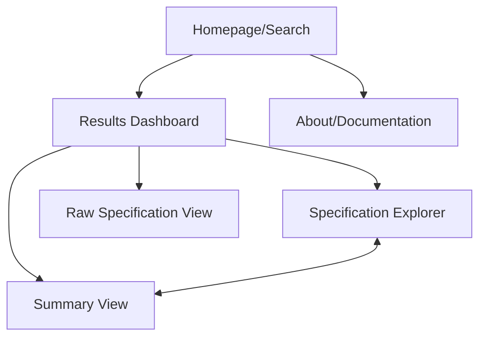
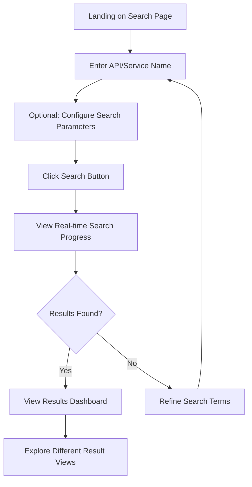
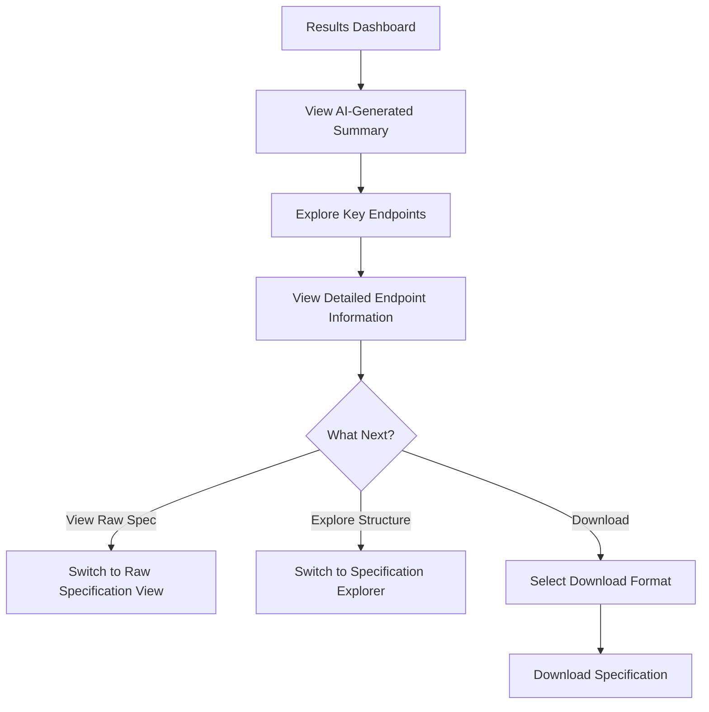
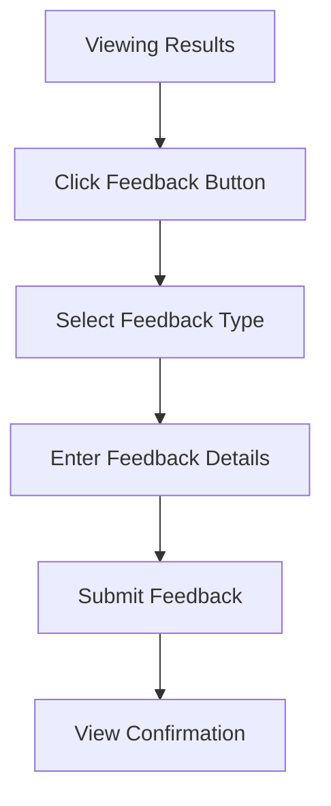

> **Superseded (2026-09-22).** This document describes the original May 2025 design and is kept for history only. The current domain language is in [`CONTEXT.md`](../CONTEXT.md), decisions are in [`docs/adr/`](adr/), and requirements are in [`docs/PRD.md`](PRD.md).

# swagger.bot UI/UX Specification

## Introduction

This document defines the user experience goals, information architecture, user flows, and visual design specifications for the swagger.bot project. It serves as the comprehensive guide for implementing the user interface and experience design of the application.

swagger.bot is a tool designed to streamline the discovery and understanding of OpenAPI/Swagger specifications. It addresses a critical challenge in the API ecosystem: the difficulty in discovering and retrieving publicly available OpenAPI specification files for applications and APIs. This UI/UX specification outlines how the application will deliver on its promise of enabling seamless API discovery and integration through an intuitive, developer-focused interface.

- **Link to Primary Design Files:** [To be established - Figma/Sketch]
- **Link to Deployed Storybook / Design System:** [To be established]

## Overall UX Goals & Principles

### Target User Personas

Based on the project brief, we've identified four key user personas for swagger.bot:

1. **API Integration Developer (Primary)**

   - **Profile:** Professional software developer responsible for integrating third-party APIs into their company's products
   - **Goals:** Quickly understand API capabilities, find endpoints relevant to their integration needs, and implement connections efficiently
   - **Pain Points:** Manual hunting for API documentation, inconsistent specification formats, incomplete or outdated documentation
   - **Technical Level:** High (comfortable with JSON/YAML, understands API concepts)

2. **Technical Product Manager**

   - **Profile:** Product manager with technical background evaluating potential API integrations
   - **Goals:** Assess API capabilities without deep technical investigation, understand integration complexity, make informed decisions about which APIs to use
   - **Pain Points:** Too much technical detail in raw specifications, difficulty extracting business value from technical documentation
   - **Technical Level:** Medium (understands API concepts but prefers higher-level summaries)

3. **API Platform Engineer**

   - **Profile:** Developer building unified API platforms that connect to multiple services
   - **Goals:** Efficiently discover and process API specifications for multiple services, understand authentication patterns across APIs
   - **Pain Points:** Inconsistent API designs, varying authentication methods, time spent finding specifications
   - **Technical Level:** Very high (expert in API design and implementation)

4. **Documentation Specialist**
   - **Profile:** Technical writer or developer responsible for maintaining API documentation
   - **Goals:** Verify official specifications, reference standard formats, ensure documentation accuracy
   - **Pain Points:** Tracking changes in API specifications, ensuring documentation matches implementation
   - **Technical Level:** Medium to high (understands API concepts, focuses on clarity and completeness)

### Usability Goals

1. **Efficiency**

   - Users should be able to find and understand API specifications within 30 seconds
   - Minimize the number of clicks/steps required to complete core tasks
   - Provide keyboard shortcuts for power users

2. **Clarity**

   - Present complex technical information in a structured, digestible format
   - Clearly distinguish between AI-generated content and directly extracted information
   - Use progressive disclosure to manage information density

3. **Confidence**

   - Provide transparency about the discovery process and confidence levels
   - Ensure users trust the accuracy and completeness of results
   - Communicate system status and progress clearly

4. **Learnability**

   - First-time users should immediately understand how to use the search functionality
   - Provide contextual help and tooltips for advanced features
   - Use familiar patterns from developer tools and documentation sites

5. **Flexibility**
   - Support both quick overview use cases and deep technical exploration
   - Allow customization of result formats and display preferences
   - Enable both programmatic (API) and interactive (UI) usage patterns

### Design Principles

1. **Developer-Centric Design**

   - Optimize for technical users with clean, efficient interfaces
   - Prioritize functionality and information density over decorative elements
   - Use familiar patterns from popular developer tools and documentation sites
   - Provide code-like presentation where appropriate (syntax highlighting, monospace fonts)

2. **Progressive Technical Disclosure**

   - Start with high-level summaries and allow drilling down to technical details
   - Layer information from simple to complex
   - Enable quick scanning for relevant information
   - Maintain context when moving between different levels of detail

3. **Transparent Intelligence**

   - Clearly indicate when content is AI-generated vs. directly extracted
   - Provide confidence scores and sources for all results
   - Allow users to verify AI interpretations against raw data
   - Design for appropriate trust - neither over-reliance nor distrust of AI capabilities

4. **Efficient Information Hierarchy**

   - Organize content based on developer priorities and mental models
   - Highlight the most important/frequently used information
   - Use visual design to create clear information hierarchy
   - Employ consistent patterns for similar types of information

5. **Responsive Performance**
   - Provide immediate feedback for all user actions
   - Show progress for operations that take time
   - Optimize for perceived performance with progressive loading
   - Design for both immediate results and background processing

## Information Architecture (IA)

### Site Map / Screen Inventory:



### Navigation Structure:

**Primary Navigation (Top Bar):**

- Logo/Home - Returns to search interface
- About/Documentation - Information about the tool and how to use it
- (Optional) User preferences - For customizing search behavior and result display

**Secondary Navigation (Results Context):**

- Tab system within the Results Dashboard:
  - Summary View (default) - AI-generated overview of the API
  - Specification Explorer - Interactive tree view of the API structure
  - Raw Specification - Complete JSON/YAML specification
  - (Optional) History/Saved - Previously discovered specifications

**Contextual Navigation:**

- Breadcrumbs showing current location in the application
- Back button to return to previous views
- Related endpoints or sections within the Specification Explorer

## User Flows

### 1. API Discovery Flow

**Goal:** User wants to find and understand an API specification for a specific service

**Steps:**



#### Detailed Steps:

1. **Landing on Search Page**

   - **UI Elements:**
     - Prominent search bar in center of page
     - Optional search parameter toggles (collapsed by default)
     - Brief explanation text above search bar
     - Example searches below search bar
   - **Interactions:**
     - Page loads with focus automatically on search input
     - Keyboard shortcut (/) also focuses search input

2. **Enter API/Service Name**

   - **UI Elements:**
     - Search input with placeholder text "Enter API or service name (e.g., Stripe, Twitter, Shopify)"
     - Auto-suggestions appear as user types (based on popular APIs)
   - **Interactions:**
     - Real-time validation of input (min 3 characters)
     - Clear button (x) appears when text is entered

3. **Configure Search Parameters (Optional)**

   - **UI Elements:**
     - Expandable "Advanced Options" section below search bar
     - Toggle switches for search strategies:
       - Web search (on by default)
       - Common path probing (on by default)
       - Direct domain scanning (off by default)
     - Dropdown for result format preference
   - **Interactions:**
     - Click/tap to expand advanced options
     - Toggle switches for enabling/disabling search strategies
     - Tooltips explain each search strategy

4. **Initiate Search**

   - **UI Elements:**
     - Primary action button "Find API Specification"
     - Keyboard shortcut (Enter) also initiates search
   - **Interactions:**
     - Button click/tap or Enter key press
     - Button transforms to loading state
     - Smooth transition to progress view

5. **View Real-time Search Progress**

   - **UI Elements:**
     - Progress indicator showing overall completion percentage
     - Status messages for each active search strategy
     - Animated indicators for in-progress strategies
     - Estimated time remaining
   - **Interactions:**
     - Cancel button to abort search
     - Option to "Show details" for more verbose progress information

6. **Results Found Check**

   - **Success Path:**
     - Smooth transition to Results Dashboard when specifications are found
     - Brief success animation/notification
   - **Error States:**
     - "No specifications found" message with suggested actions:
       - Try different search terms
       - Enable additional search strategies
       - Check if API name is correct
     - Option to submit this failed search for review by the team

7. **View Results Dashboard**
   - **UI Elements:**
     - Header showing search query and result count
     - Confidence score indicator (visual meter)
     - Source information (where specification was found)
     - Tabs for different views (Summary, Explorer, Raw)
     - Action buttons (Download, Share, Feedback)
   - **Interactions:**
     - Default view is Summary tab
     - Hover states on all interactive elements
     - Click/tap to switch between tabs

### 2. Specification Exploration Flow

**Goal:** User wants to explore and understand the details of a discovered API

**Steps:**



#### Detailed Steps:

1. **Results Dashboard Initial View**

   - **UI Elements:**
     - API name and version in header
     - Metadata panel (auth requirements, endpoint count, last updated)
     - Tab navigation (Summary, Explorer, Raw)
     - Action buttons (Download, Share, Feedback)
   - **Interactions:**
     - Smooth scrolling through content
     - Sticky header with tabs remains visible on scroll

2. **View AI-Generated Summary**

   - **UI Elements:**
     - Clear "AI-Generated" label on summary content
     - Concise overview of API purpose and capabilities
     - Key endpoints highlighted in cards
     - Authentication requirements explained in simple terms
     - Potential use cases section
   - **Interactions:**
     - Expandable sections for more detailed information
     - Copy code snippets with one click
     - Hover on technical terms shows explanatory tooltips

3. **Explore Key Endpoints**

   - **UI Elements:**
     - Categorized endpoint list
     - Visual indicators for endpoint methods (GET, POST, etc.)
     - Search/filter input for endpoints
     - Sort options (alphabetical, by category, by importance)
   - **Interactions:**
     - Click/tap endpoint to expand details
     - Hover states show brief description
     - Keyboard navigation between endpoints

4. **View Detailed Endpoint Information**

   - **UI Elements:**
     - Endpoint URL with method indicator
     - Required and optional parameters with types
     - Example request (with syntax highlighting)
     - Example response (with syntax highlighting)
     - Related endpoints section
   - **Interactions:**
     - Toggle between different example requests/responses
     - Copy button for code examples
     - Expand/collapse parameter details

5. **Switch Between Views**

   - **UI Elements:**
     - Tab navigation consistently available
     - Visual indicator of current tab
     - Smooth transitions between views
   - **Interactions:**
     - Click/tap tab to switch view
     - Keyboard shortcuts (1,2,3) to switch tabs
     - Current state/position preserved when switching back

6. **Raw Specification View**

   - **UI Elements:**
     - Syntax-highlighted JSON/YAML
     - Line numbers
     - Format toggle (JSON/YAML)
     - Search in specification
     - Collapsible sections
   - **Interactions:**
     - Expand/collapse sections
     - Copy entire specification or sections
     - Download in preferred format

7. **Specification Explorer View**

   - **UI Elements:**
     - Interactive tree view of specification structure
     - Split-pane layout (navigation tree + details)
     - Search across specification
     - Breadcrumb navigation
   - **Interactions:**
     - Click to expand/collapse tree nodes
     - Select node to view details in right pane
     - Resize split panes
     - Filter tree by endpoint type or path

8. **Download Specification**
   - **UI Elements:**
     - Download button with dropdown options
     - Format selection (JSON, YAML, HTML documentation)
     - Optional: Include AI summary checkbox
   - **Interactions:**
     - Select format and options
     - Click download to save file
     - Success confirmation after download

### 3. Feedback Submission Flow

**Goal:** User wants to provide feedback on search results or AI-generated content

**Steps:**



#### Detailed Steps:

1. **Initiate Feedback**

   - **UI Elements:**
     - Feedback button consistently available in header
     - Contextual feedback icons next to AI-generated content
   - **Interactions:**
     - Click/tap feedback button or icon
     - Keyboard shortcut (Alt+F) to open feedback form

2. **Select Feedback Type**

   - **UI Elements:**
     - Radio button options for feedback categories:
       - Incorrect or missing information
       - AI summary quality
       - UI/UX suggestion
       - General feedback
     - Brief explanation for each category
   - **Interactions:**
     - Select single category
     - Option to change selection

3. **Provide Feedback Details**

   - **UI Elements:**
     - Text area for detailed feedback
     - Optional screenshot attachment
     - Checkbox to include technical details (browser, search parameters)
     - Character counter for text input
   - **Interactions:**
     - Type feedback (min 10 characters)
     - Drag-and-drop or select file for screenshot
     - Toggle checkbox for including technical details

4. **Submit Feedback**

   - **UI Elements:**
     - Submit button
     - Cancel button
     - Loading state during submission
   - **Interactions:**
     - Click submit to send feedback
     - Validation ensures minimum required information

5. **Confirmation View**
   - **UI Elements:**
     - Success message with thank you note
     - Reference ID for the feedback
     - Option to submit another feedback item
     - Return to previous view button
   - **Interactions:**
     - Click to submit another feedback item
     - Click to return to previous view
     - Automatic return after 5 seconds (with countdown)

## Component Library / Design System Approach

### Design System Philosophy

For swagger.bot, we'll implement a pragmatic, developer-focused design system that leverages shadcn components with Tailwind CSS. This approach balances several key considerations:

1. **Efficiency in Implementation:** Using established component libraries (shadcn) accelerates development while maintaining quality
2. **Developer Experience:** Components should be intuitive for the development team to use and extend
3. **Consistency:** Ensuring visual and interaction consistency across the application
4. **Performance:** Lightweight components optimized for fast rendering
5. **Accessibility:** Built-in accessibility features that require minimal additional configuration

### Technology Foundation

- **Base Framework:** React with TypeScript
- **Styling System:** Tailwind CSS for utility-first styling
- **Component Library:** shadcn components (which are built on Radix UI primitives)
- **Icons:** Lucide icons for consistent, developer-friendly iconography
- **Code Highlighting:** Prism.js or Shiki for syntax highlighting of API specifications

### Core Component Categories

#### 1. Layout Components

- **Page Layout:** Consistent page structure with header, main content area, and optional sidebar
- **Container:** Responsive container with appropriate max-width and padding
- **Grid System:** Flexible grid layout using Tailwind's grid utilities
- **Card:** Container for discrete content blocks with consistent styling
- **Split View:** Resizable split-pane layout for the Specification Explorer

#### 2. Navigation Components

- **Top Navigation Bar:** Primary navigation with logo, search, and user actions
- **Tabs:** For switching between different views of the same content
- **Breadcrumbs:** For hierarchical navigation in the Specification Explorer
- **Sidebar Navigation:** Collapsible tree view for API structure

#### 3. Input Components

- **Search Input:** Primary search field with autocomplete and clear functionality
- **Toggle Switches:** For enabling/disabling search strategies
- **Dropdowns:** For selection from predefined options
- **Checkboxes & Radio Buttons:** For binary choices and option selection
- **Text Areas:** For feedback submission and notes

#### 4. Display Components

- **API Card:** Specialized card for displaying API information with metadata
- **Endpoint Item:** Component for displaying API endpoint with method, path, and description
- **Code Block:** Syntax-highlighted code display with copy functionality
- **Specification Tree:** Interactive tree view for navigating API structure
- **Progress Indicator:** For showing search and processing status
- **Confidence Meter:** Visual indicator of result confidence

#### 5. Feedback Components

- **Toast Notifications:** For system messages and confirmations
- **Alert Boxes:** For important information and warnings
- **Loading States:** Consistent loading indicators for all async operations
- **Empty States:** Designed views for when no results are found
- **Error States:** Standardized error presentation

### State Management Strategy

We'll implement a multi-layered approach to state management that separates concerns and optimizes for different types of state:

```
┌─────────────────────────────────────────┐
│ Global Application State                │
│ (Context API + React Query Cache)       │
├─────────────┬─────────────┬─────────────┤
│ Search      │ User        │ System      │
│ State       │ Preferences │ Status      │
└─────────────┴─────────────┴─────────────┘
        │             │             │
        ▼             ▼             ▼
┌─────────────────────────────────────────┐
│ Feature-Level State                     │
│ (React Query + Local Context)           │
├─────────────┬─────────────┬─────────────┤
│ API Spec    │ Explorer    │ Summary     │
│ Data        │ Navigation  │ Generation  │
└─────────────┴─────────────┴─────────────┘
        │             │             │
        ▼             ▼             ▼
┌─────────────────────────────────────────┐
│ Component-Level State                   │
│ (useState + useReducer)                 │
├─────────────┬─────────────┬─────────────┤
│ UI State    │ Form State  │ Interaction │
│ (expanded)  │ (inputs)    │ (hover)     │
└─────────────┴─────────────┴─────────────┘
```

#### Key State Management Approaches:

1. **React Query for Server State:**

   - API specification data fetching and caching
   - Search progress and results management
   - AI-generated summaries

2. **React Context for Global UI State:**

   - Theme and preferences
   - User settings
   - Global application state

3. **Component-Level State:**

   - UI interactions (expanded/collapsed states)
   - Form inputs and validation
   - Local component state

4. **LangGraph Integration:**
   - Workflow state management
   - Process orchestration

## Branding & Style Guide Basics

### Brand Identity Overview

swagger.bot's visual identity reflects its core purpose as a developer tool while maintaining a professional, modern aesthetic. The brand identity emphasizes clarity, efficiency, and technical precision while incorporating subtle visual elements that create a distinctive and memorable experience.

### Color Palette

#### Primary Colors

```
Primary Blue: #0F62FE
  - Hex: #0F62FE
  - RGB: 15, 98, 254
  - HSL: 217, 99%, 53%
  - Usage: Primary actions, key UI elements, brand identity

Secondary Blue: #0043CE
  - Hex: #0043CE
  - RGB: 0, 67, 206
  - HSL: 217, 100%, 40%
  - Usage: Hover states, secondary actions, selected states
```

#### Neutral Colors

```
Background Light: #F4F4F4
  - Hex: #F4F4F4
  - RGB: 244, 244, 244
  - Usage: Page backgrounds, subtle containers

Background Dark: #161616
  - Hex: #161616
  - RGB: 22, 22, 22
  - Usage: Dark mode backgrounds

Surface Light: #FFFFFF
  - Hex: #FFFFFF
  - RGB: 255, 255, 255
  - Usage: Cards, dialogs, elevated surfaces

Surface Dark: #262626
  - Hex: #262626
  - RGB: 38, 38, 38
  - Usage: Dark mode cards and surfaces

Border Light: #E0E0E0
  - Hex: #E0E0E0
  - RGB: 224, 224, 224
  - Usage: Subtle separators and borders

Border Dark: #393939
  - Hex: #393939
  - RGB: 57, 57, 57
  - Usage: Dark mode borders
```

#### Text Colors

```
Text Primary Light: #161616
  - Hex: #161616
  - RGB: 22, 22, 22
  - Usage: Primary text in light mode

Text Secondary Light: #525252
  - Hex: #525252
  - RGB: 82, 82, 82
  - Usage: Secondary text, labels in light mode

Text Primary Dark: #F4F4F4
  - Hex: #F4F4F4
  - RGB: 244, 244, 244
  - Usage: Primary text in dark mode

Text Secondary Dark: #A8A8A8
  - Hex: #A8A8A8
  - RGB: 168, 168, 168
  - Usage: Secondary text, labels in dark mode
```

#### Semantic Colors

```
Success: #198038
  - Hex: #198038
  - RGB: 25, 128, 56
  - Usage: Success states, confirmations

Warning: #F1C21B
  - Hex: #F1C21B
  - RGB: 241, 194, 27
  - Usage: Warnings, caution states

Error: #DA1E28
  - Hex: #DA1E28
  - RGB: 218, 30, 40
  - Usage: Error states, destructive actions

Info: #0043CE
  - Hex: #0043CE
  - RGB: 0, 67, 206
  - Usage: Informational messages
```

#### HTTP Method Colors

```
GET: #0F62FE
  - Hex: #0F62FE
  - RGB: 15, 98, 254

POST: #24A148
  - Hex: #24A148
  - RGB: 36, 161, 72

PUT: #FF832B
  - Hex: #FF832B
  - RGB: 255, 131, 43

DELETE: #DA1E28
  - Hex: #DA1E28
  - RGB: 218, 30, 40

PATCH: #8A3FFC
  - Hex: #8A3FFC
  - RGB: 138, 63, 252

OPTIONS: #A8A8A8
  - Hex: #A8A8A8
  - RGB: 168, 168, 168
```

### Typography

#### Font Families

```
UI Font: Inter
  - Weights: 400 (Regular), 500 (Medium), 600 (SemiBold)
  - Usage: All UI elements, headings, body text

Monospace Font: JetBrains Mono
  - Weights: 400 (Regular), 700 (Bold)
  - Usage: Code blocks, API paths, JSON/YAML content
```

#### Type Scale

```
Display: 32px / 2rem (Line height: 40px)
  - Weight: 600 (SemiBold)
  - Usage: Major page headings, landing page

Heading 1: 24px / 1.5rem (Line height: 32px)
  - Weight: 600 (SemiBold)
  - Usage: Section headings, modal titles

Heading 2: 20px / 1.25rem (Line height: 28px)
  - Weight: 600 (SemiBold)
  - Usage: Subsection headings, card titles

Heading 3: 16px / 1rem (Line height: 24px)
  - Weight: 600 (SemiBold)
  - Usage: Minor headings, group labels

Body: 14px / 0.875rem (Line height: 20px)
  - Weight: 400 (Regular)
  - Usage: Primary body text

Small: 12px / 0.75rem (Line height: 16px)
  - Weight: 400 (Regular)
  - Usage: Labels, captions, metadata

Code: 14px / 0.875rem (Line height: 20px)
  - Font: JetBrains Mono
  - Weight: 400 (Regular)
  - Usage: Inline code, small code snippets

Code Block: 13px / 0.8125rem (Line height: 20px)
  - Font: JetBrains Mono
  - Weight: 400 (Regular)
  - Usage: Multi-line code blocks, API specifications
```

### Iconography

swagger.bot uses a consistent icon system based on Lucide icons, a modern open-source icon set that works well with the overall design aesthetic.

#### Icon Usage

- **Navigation Icons:** Used in navigation elements, 24px size
- **Action Icons:** Used for interactive elements, 20px size
- **Status Icons:** Used to indicate status or state, 16px size
- **Indicator Icons:** Used alongside text for additional context, 16px size

### Spacing & Grid System

swagger.bot uses a consistent spacing system based on a 4px base unit, implemented through Tailwind CSS's spacing scale.

#### Spacing Scale

```
4px - Extra small spacing (0.25rem / 1 unit)
8px - Small spacing (0.5rem / 2 units)
12px - Medium-small spacing (0.75rem / 3 units)
16px - Medium spacing (1rem / 4 units)
24px - Medium-large spacing (1.5rem / 6 units)
32px - Large spacing (2rem / 8 units)
48px - Extra large spacing (3rem / 12 units)
```

#### Layout Grid

- **Container Width:** Maximum 1280px with responsive padding
- **Column System:** 12-column grid for larger screens, fluid single column for mobile
- **Gutters:** 16px (small screens) to 24px (large screens)

## Responsiveness

### Breakpoints

swagger.bot implements a responsive design system with the following breakpoints, aligned with Tailwind CSS's default breakpoint system:

```
Small (sm): 640px and above
  - Typical use case: Small laptops, tablets in landscape orientation
  - Design focus: Simplified layouts with core functionality preserved

Medium (md): 768px and above
  - Typical use case: Tablets, larger tablets in portrait orientation
  - Design focus: Enhanced layouts with most features available

Large (lg): 1024px and above
  - Typical use case: Laptops, desktops with medium-sized screens
  - Design focus: Full feature set with optimized layouts

Extra Large (xl): 1280px and above
  - Typical use case: Large desktop monitors
  - Design focus: Expanded layouts with maximum information density

2X Large (2xl): 1536px and above
  - Typical use case: Extra large monitors, ultrawide displays
  - Design focus: Enhanced multi-column layouts, side-by-side views
```

### Layout Adaptation Strategy

swagger.bot follows a "mobile-last" approach that prioritizes the desktop experience while ensuring graceful degradation for smaller screens:

- **Desktop-First Design:** Core interfaces are designed for desktop first, then adapted for smaller screens
- **Feature Prioritization:** Critical features remain accessible on all screen sizes, while secondary features may be simplified or hidden on smaller screens
- **Responsive Testing:** All interfaces are tested across breakpoints to ensure functionality is preserved

### Content Prioritization Framework

To ensure the most important content and functionality remains accessible across all screen sizes, swagger.bot implements a systematic content prioritization framework:

#### Priority Levels

1. **Critical (Always Visible)**

   - Search functionality
   - Primary navigation
   - Core result data
   - Essential actions (download, share)

2. **High Priority (Visible on Small+ Screens)**

   - Advanced search options
   - Confidence indicators
   - Summary information
   - Primary metadata

3. **Medium Priority (Visible on Medium+ Screens)**

   - Detailed endpoint information
   - Secondary actions
   - Visualization tools
   - Extended metadata

4. **Low Priority (Visible on Large+ Screens)**
   - Contextual help
   - Related information
   - Historical data
   - Advanced customization options

## Accessibility Requirements

### Compliance Standards

swagger.bot targets the following accessibility compliance standards:

- **Primary Standard:** Web Content Accessibility Guidelines (WCAG) 2.1 Level AA
- **Secondary Standards:**
  - Section 508 of the Rehabilitation Act (US)
  - EN 301 549 (EU)

### Key Accessibility Requirements

#### 1. Keyboard Accessibility

All functionality must be operable through a keyboard interface without requiring specific timings for individual keystrokes.

- **Complete Navigation:** Users must be able to navigate to all interactive elements using the keyboard
- **Focus Indicators:** Visible focus indicators must be provided for all interactive elements (minimum 3:1 contrast ratio)
- **Focus Order:** Logical focus order that preserves meaning and operability
- **Keyboard Shortcuts:** Application-specific keyboard shortcuts for common actions

#### 2. Screen Reader Compatibility

The application must be fully usable with screen readers and other assistive technologies.

- **Semantic HTML:** Use appropriate HTML elements that convey structure and meaning
- **ARIA Attributes:** Implement ARIA roles, states, and properties where native HTML semantics are insufficient
- **Dynamic Content Updates:** Announce dynamic content changes using ARIA live regions
- **Custom Components:** Ensure all custom components implement appropriate ARIA patterns

#### 3. Visual Accessibility

The application must be visually accessible to users with various visual impairments.

- **Text Contrast:** Minimum contrast ratio of 4.5:1 for normal text and 3:1 for large text
- **UI Component Contrast:** Minimum contrast ratio of 3:1 for UI components and graphical objects
- **Color Independence:** Information must not be conveyed by color alone
- **Focus Indicators:** Visible focus indicators with minimum 3:1 contrast ratio

#### 4. Cognitive Accessibility

The application must be usable by people with various cognitive abilities.

- **Clear Language:** Use clear, simple language in the interface
- **Consistent Navigation:** Consistent placement of navigation elements
- **Error Prevention:** Provide clear error messages and prevention mechanisms
- **Autofill Support:** Support browser autofill for forms
- **Progress Indication:** Clear indication of progress in multi-step processes

#### 5. Technical Accessibility for Developer Tools

As a developer-focused application, swagger.bot must implement specialized accessibility features for technical content.

- **Code Navigation:** Allow keyboard navigation through code blocks line by line
- **Code Highlighting:** Ensure syntax highlighting meets contrast requirements
- **Structured Data:** Provide accessible ways to navigate complex data structures
- **Technical Terms:** Provide explanations or tooltips for technical terminology

## Wireframes & Mockups

[This section will be developed in a future iteration with visual designs for key screens]

## Change Log

| Change        | Date       | Version | Description                                                                                                                                                     | Author                    |
| ------------- | ---------- | ------- | --------------------------------------------------------------------------------------------------------------------------------------------------------------- | ------------------------- |
| Initial Draft | 2025-05-21 | 0.1     | Created initial UI/UX specification with information architecture, user flows, design system approach, branding, responsiveness, and accessibility requirements | Millie (Design Architect) |
